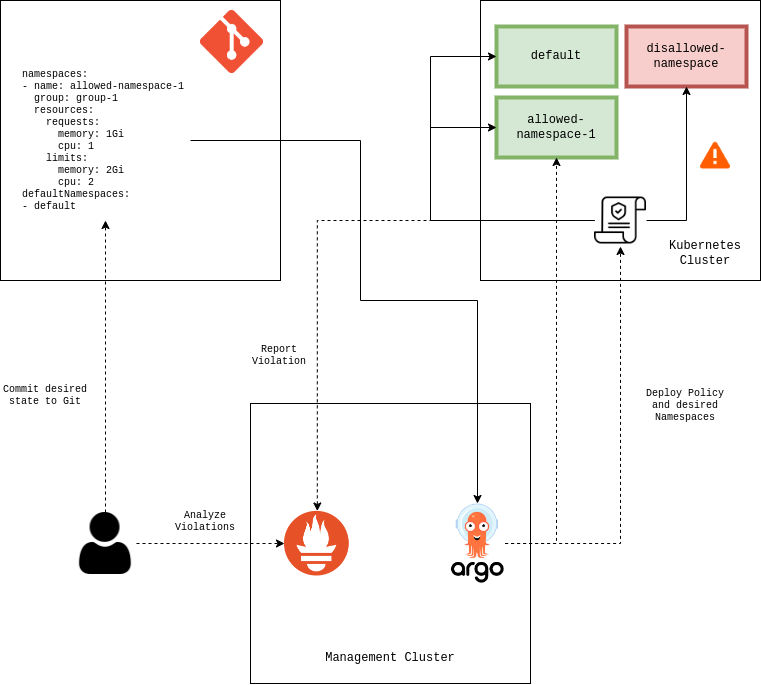
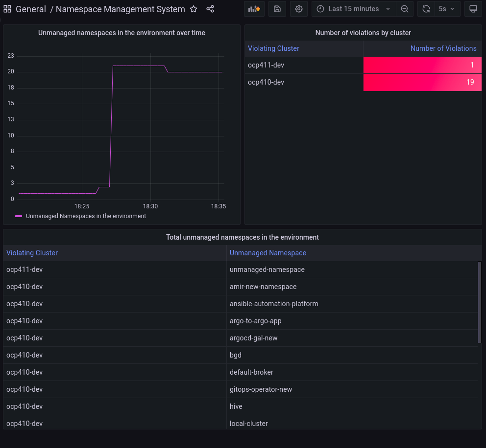

# GitOps Governance

The repository provides an example for how you can create a governance strategy for namespace management in multi cluster Kubernetes environments by using GitOps.

The example provided in this repository addresses a scenario in which all Kubernetes clusters must be identical. Therefore, the same governance policy is generated for all managed Kubernetes clusters.

## Prerequisites

* [ArgoCD](https://github.com/argoproj/argo-cd) installed on a central management hub.
* [Gatekeeper](https://github.com/open-policy-agent/gatekeeper) installed on each managed cluster.

## Overview

The governance policy is implemented via a Helm chart that receives a [values](charts/gitops-governance/values.yaml) file that describes a desired state in the environment. The `values` file describes the namespaces that should be present in the environment alongside default system namespaces which are not managed by the chart.

The structure of the `values` file would be similar to the next snippet -

```
namespaces:
  - name: allowed-namespace-1
    group: group-1
    resources:
      requests:
        memory: 1Gi
        cpu: 1
      limits:
        memory: 2Gi
        cpu: 2
...
defaultNamespaces:
  - default
```

Based on the input from the `values` file, the chart generates the following resources -

* **Namespace** - A namespace for each instance in the `namespaces` list.
* **RoleBinding** - A binding between the `admin` role and the group at `namespaces[_].group` in order to allow user access to the namespace.
* **ResourceQuota** - A quota based on `namespaces[_].resources` that limits the resource consumption by the pods in the namespace.
* **LimitRange** - A default limit which is set for running pods in the created namespace.
* **Gatekeeper Constraint** - A gatekeeper constraint that initiates a policy violation whenever there is a namespace in the Kubernetes cluster that does not appear in the `namespaces` or `defaultNamespaces` list in the `values` file.

By using the `values` file you are able to declare all namespaces for the Kubernetes environment in git. You can control their associated resource limits / RBAC settings and initiate a violation whenever an unmanaged namespace appears.

## Deployment

The solution may be deployed by using the [Helm](https://github.com/helm/helm) binary or by using an ArgoCD Application / ApplicationSet resources.

### Using Helm

To install the solution via Helm, make sure to edit the [values](charts/gitops-governance/values.yaml) file localy. Modify the file according to the desired state in your environment. Run the next command to install the chart -

```
$ helm install --generate-name charts/gitops-governance
```

### Using ArgoCD

To install the solution via ArgoCD, make sure to fork the repository, update the [values](charts/gitops-governance/values.yaml) file and generate an Application / ApplicationSet resource that points to your fork. An example ArgoCD ApplicationSet can be found [here](argocd/applicationset.yaml).

## Architecture

An architecture diagram for the solution can be found here -



## Monitoring Governance

The Gatekeeper policy results can be monitored by using [Prometheus](https://github.com/prometheus) or [Thanos](https://github.com/thanos-io/thanos). Metrics from Gatekeeper policies can be gathered by using the default Gatekeeper `/metrics` endpoint or by third party exporters (e.g - [opa-scorecard](https://github.com/mcelep/opa-scorecard)).

Governance visualization can be created by using tools like [Grafana](https://github.com/grafana/grafana). An example dashboard can be found [here](dashboards/dashboard.json).

